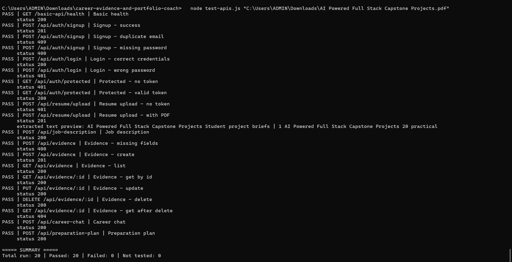
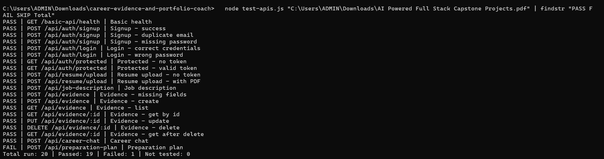
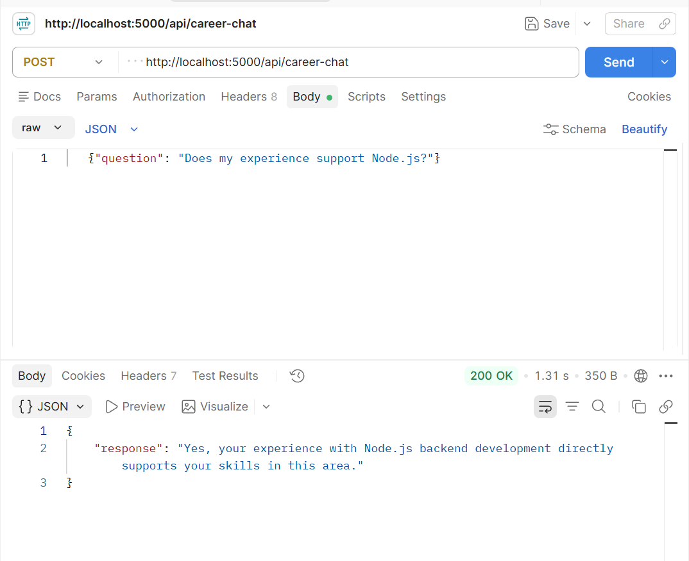
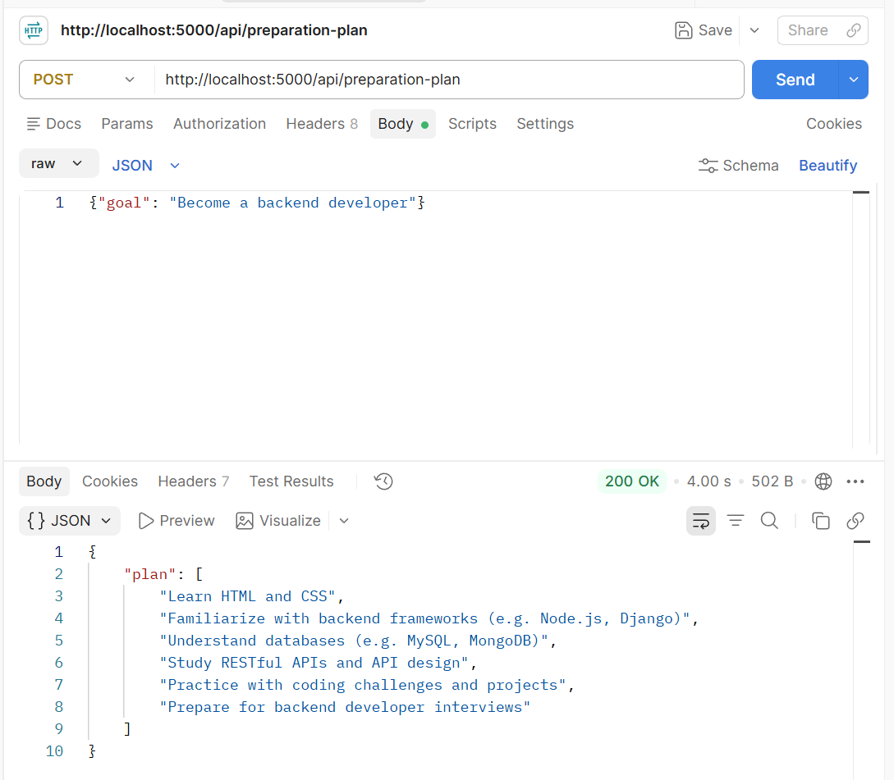
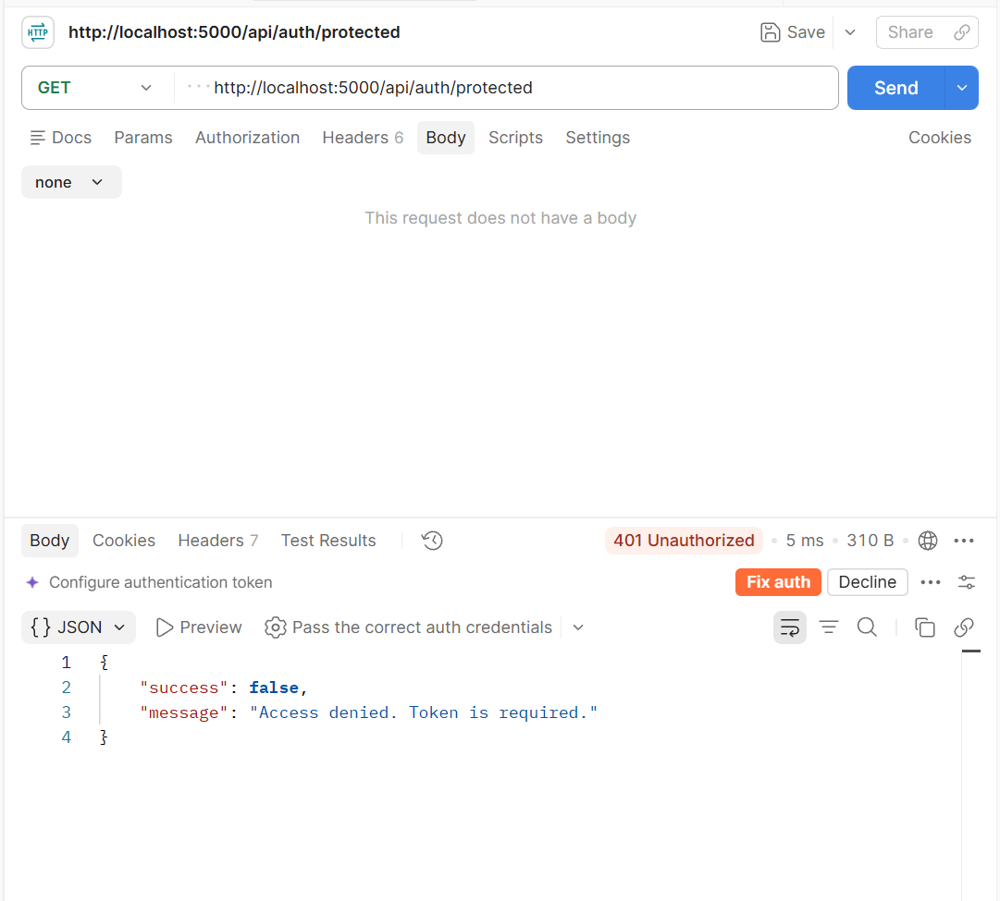
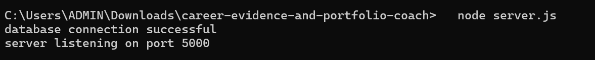

# API Test Report

**Project:** Career Evidence and Portfolio Coach

**Tester:** Member 63

**Date:** 10 October 2026

**Code tested:** latest `main` branch of the team repository

**Environment:** server running locally at `http://localhost:5000`, connected to the team's MongoDB Atlas database

**How it was run:** `node test-apis.js "<path to a sample PDF>"`

## Summary

| Measure | Count |

|---|---|

| Tests executed in the main run | 20 |

| Passed in the main run | 20 |

| Failed in the main run | 0 |

| Not tested | 0 |

One additional run of the same script gave 19 passed and 1 failed. The failure was **Preparation Plan** (`500`, "Failed to generate plan"). The server log for that run shows `AI error: Unexpected end of JSON input`. The same API passed in the other runs, so this looks intermittent. See "Bugs Discovered".

Career Chat and Preparation Plan need a local Ollama instance running the `llama3.2` model (both APIs call `http://localhost:11434/api/generate`). On the first runs, before Ollama was installed on the tester's machine, both returned `500` (server log: `AI error: fetch failed`). After installing Ollama and the `llama3.2` model, both passed in most runs.

The script checks the status code and that a response body is present (for Career Chat, that `response` is a non-empty text). It does not judge the quality of the AI answers. See the Postman screenshots for actual response content.

## Results

| API | Method | Expected Result | Actual Result | Status |

|---|---|---|---|---|

| Basic health, `/basic-api/health` | GET | Successful response | 200 | Pass |

| Signup, `/api/auth/signup` | POST | Account created | 201 | Pass |

| Signup, duplicate email | POST | 400 or 409 | 409 | Pass |

| Signup, missing password | POST | 400 | 400 | Pass |

| Login, correct credentials, `/api/auth/login` | POST | Token returned | 200 with token | Pass |

| Login, wrong password | POST | 401 | 401 | Pass |

| Protected route, no token, `/api/auth/protected` | GET | 401 | 401 | Pass |

| Protected route, valid token | GET | 200 | 200 | Pass |

| Resume upload, no token, `/api/resume/upload` | POST | 401 | 401 | Pass |

| Resume upload, with PDF | POST | PDF text extracted | 201, extracted text present ("AI Powered Full Stack Capstone Projects...") | Pass |

| Job description, `/api/job-description` | POST | Accepted with a response | 200 | Pass |

| Evidence, missing fields, `/api/evidence` | POST | 400 | 400 | Pass |

| Evidence, create | POST | Record created with an id | 201 with id | Pass |

| Evidence, list | GET | New record appears in the list | 200, record present | Pass |

| Evidence, get by id | GET | Same record returned | 200, same id | Pass |

| Evidence, update | PUT | Updated title returned | 200, title updated | Pass |

| Evidence, delete | DELETE | Record deleted | 200 | Pass |

| Evidence, get after delete | GET | 404 | 404 | Pass |

| Career Chat, `/api/career-chat` | POST | Answer returned | 200 with a text response (local Ollama, `llama3.2`) | Pass |

| Preparation Plan, `/api/preparation-plan` | POST | Plan returned | 200 with a plan in most runs; 500 "Failed to generate plan" in one run | Pass (intermittent failure) |

## APIs Not Tested and Why

| API | Owner | Reason |

|---|---|---|

| RAG and vector search | Member 58 | No route is registered in `server.js`, so there is nothing to call through the API yet. |

MongoDB connectivity (Member 5) was confirmed indirectly: the server connected to Atlas and all database tests above passed.

## Bugs Discovered

**Intermittent failure, Member 62 (Preparation Plan):** in one run the API returned `500` "Failed to generate plan" and the server log showed `AI error: Unexpected end of JSON input`. It passed in the other runs. This suggests the AI reply was sometimes empty or incomplete and the code could not read it as JSON. The exact line was not investigated. Suggested follow-up: handle an empty or incomplete AI reply, for example by retrying once.

No other confirmed bugs in the APIs that could be tested.

Minor notes:

- **Member 51 (Evidence):** the server warns that the update code uses a deprecated Mongoose option (`new`). It still works. Suggested fix: use `returnDocument: 'after'`.

- **Member 35 (Resume):** on the latest `main` the upload returns `201` with the details inside a `resume` object, while the earlier branch screenshot showed `200` with `text` at the top level. Worth confirming this is the intended final response.

- **Member 59 (Career Chat):** the answer to "Does my experience support Node.js?" was generic and did not mention any specific stored evidence. The API works, but it was not shown to ground its answer in saved evidence.

- **Member 62 (Preparation Plan):** when it worked, it returned a six-step plan for the goal "Become a backend developer".

## Notes on Test Data

Each run creates one test user (`apitest_<number>@test.com`) in the shared database. The evidence test creates a record and deletes it again. Test users can be removed by Member 5.

## Screenshots

**1. Test script running in the terminal (PASS/FAIL lines and summary)**

Main run, 20 passed:

Another run where Preparation Plan failed once (19 passed, 1 failed):

**2. Successful API responses in Postman**

Career Chat (`POST /api/career-chat`, 200 OK):

Preparation Plan (`POST /api/preparation-plan`, 200 OK):

**3. Unauthorized response (protected route without a token)**

**4. Server running and connected to the database**

## Unresolved Issues and Dependencies

- Preparation Plan failed intermittently once (`Unexpected end of JSON input`). Needs a look from Member 62.

- RAG and vector search have no API route yet.

- Career Chat and Preparation Plan only work on a machine that has Ollama running with `llama3.2`. Team members testing them need the same setup.

